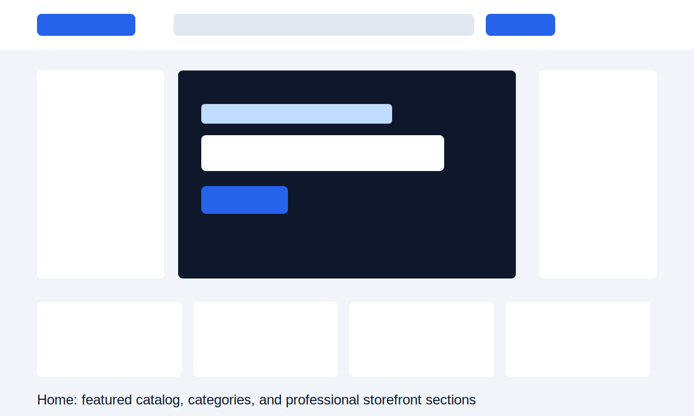
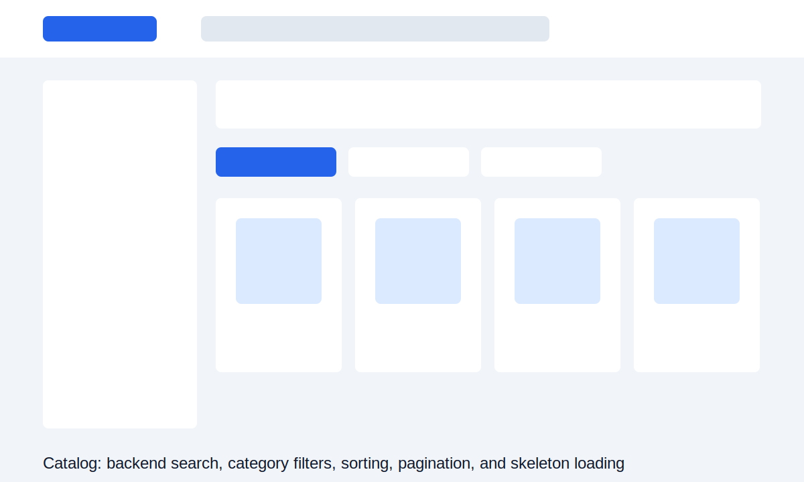
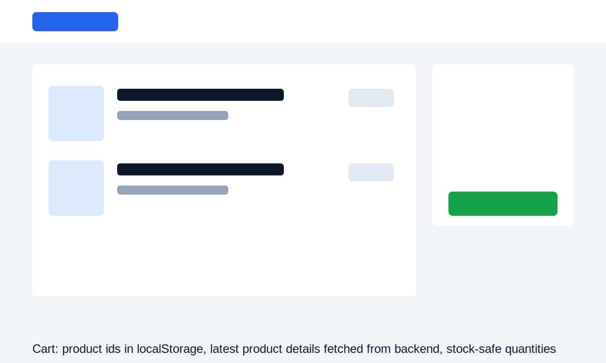

# Ecommerce Fullstack Design

Production-quality Week 2 ecommerce project using React, Tailwind CSS, Node.js, Express, MongoDB, and Mongoose.

## Screenshots







## Requirements

- Node.js
- Local MongoDB running at `mongodb://127.0.0.1:27017/ecommerceDB`

## Backend Setup

```bash
cd backend
npm install
copy .env.example .env
npm run seed
npm run dev
```

Backend runs at:

```text
http://localhost:5000
```

API endpoints:

```text
GET    /api/products
GET    /api/products?page=1&limit=8
GET    /api/products?sort=price-low
GET    /api/products?sort=price-high
GET    /api/products?sort=newest
GET    /api/products?search=shirt&category=Clothes%20and%20wear
GET    /api/products/featured
GET    /api/products/:id
POST   /api/products
PUT    /api/products/:id
DELETE /api/products/:id
```

Product API responses include computed `stockStatus`: `inStock`, `lowStock`, or `outOfStock`.

## Frontend Setup

```bash
cd frontend
npm install
copy .env.example .env
npm run dev
```

Frontend runs at:

```text
http://localhost:5173
```

## Data Flow

- MongoDB products collection is the single source of truth for products.
- The frontend fetches product data with Axios from `VITE_API_URL`.
- Cart localStorage stores only `productId` and `quantity`.
- Cart and checkout fetch the latest product details from the backend before display.
- Backend validation prevents negative product price or stock values.
- Product listing supports backend pagination, search, category filters, and sorting.

## Frontend Features

- Axios instance in `frontend/src/api/axios.js`
- Custom hooks: `useProducts`, `useProduct`, `useCart`
- Product skeleton loading cards
- Debounced catalog search
- Category filter buttons
- Price sorting dropdown
- Cart item count in the navbar
- Toast notifications for cart add/remove/clear
- Empty cart state
- API error state with retry buttons
